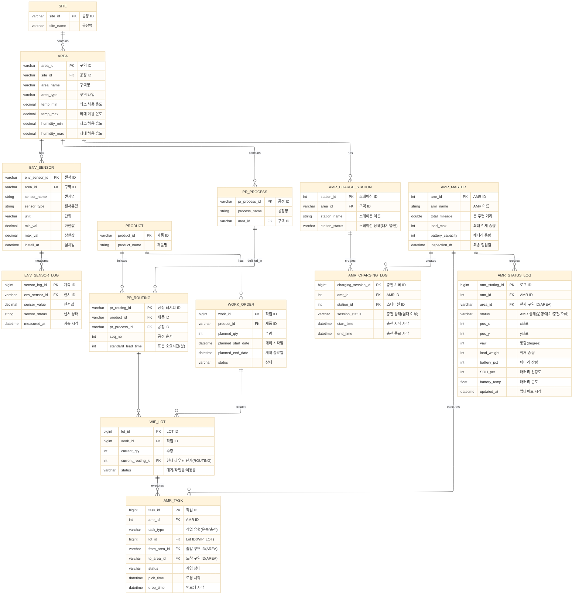

# 엔터티 및 관계 정의

- 주요 Entity
    - AREA(구역): 공장 운영을 위한 단위 구역 정의
        - e.g.) 창고, 건조 구역, 조립 구역, 검사 구역 등
        - 최대 허용 온도, 최대 허용 습도 등에 대한 정보가 포함됨
        - ENV_SENSOR(센서 정의)와 ENV_READING(센서값 기록)를 통해 구역별 환경 정보 모니터링
    - PRODUCT(제품): 제품 정의
    - PROCESS_MASTER(공정): 공정 이름, 수행 구역 정의
        - ROUTING을 통해 제품별 공정 순서 정의
    - WORK_ORDER(주문)
        - 주문에 따라 생산 단위 WIP_LOT가 결정됨
    - AMR: AMR 이름, 누적 주행 거리, 최종 점검일 등 저장
        - AMR_STATUS_LOG를 통해 상태 기록 관리
        - AMR_TASK를 통해 AMR별로 할당된 작업 관리
    - AMR_CHARGE_STATION: 충전 스테이션 위치, 상태 등 저장
        - AMR_CHARGING_SESSION을 통해 충전 기록 관리
- 주요 모니터링 요소
    - 공장 환경: 공장 내 온도, 습도, 먼지 농도
    - AMR 위치 및 상태: AMR 운영 상태, IMU(x, y, yaw), 적재 중량, 배터리 잔량, 온도, 건강도, 누적 주행거리
    - 제조 데이터: AMR 작업 목록, 주문/생산량

# ERD 작성

