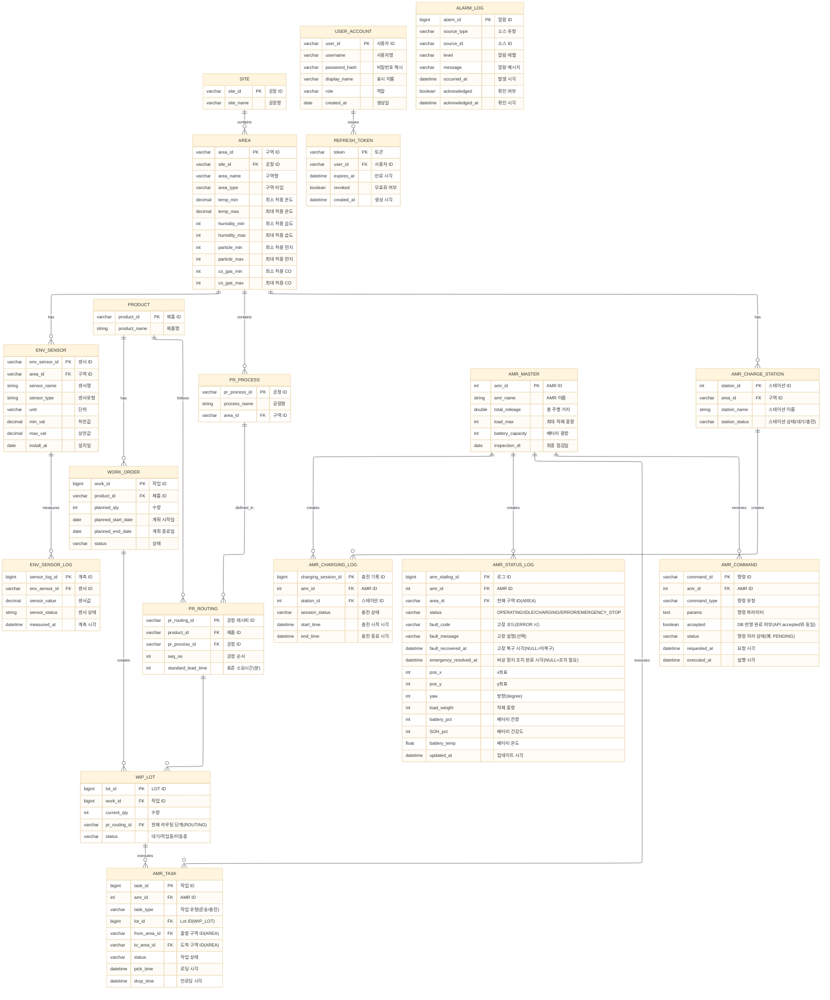

# 엔터티 및 관계 정의

- 주요 Entity
    - AREA(구역): 공장 운영을 위한 단위 구역 정의
        - e.g.) 창고, 건조 구역, 조립 구역, 검사 구역 등
        - 최대 허용 온도, 최대 허용 습도 등에 대한 정보가 포함됨
        - ENV_SENSOR(센서 정의)와 ENV_SENSOR_LOG(센서값 기록)를 통해 구역별 환경 정보 모니터링
    - PRODUCT(제품): 제품 정의
    - PROCESS_MASTER(공정): 공정 이름, 수행 구역 정의
        - ROUTING을 통해 제품별 공정 순서 정의
    - WORK_ORDER(주문)
        - 주문에 따라 생산 단위 WIP_LOT가 결정됨
    - AMR_MASTER: AMR 이름, 누적 주행 거리, 최종 점검일 등 저장
        - AMR_STATUS_LOG: 시뮬레이션·관제 기준 **운행 상태·위치 스냅샷** (물리 DDL: `DB/init.sql`)
        - AMR_COMMAND: FE→BE 제어 명령 이력 (`accepted`는 DB 반영 완료)
        - AMR_TASK: AMR별 할당 작업(비상 정지 시 정책에 따라 상태 정리)
    - AMR_CHARGE_STATION: 충전 스테이션 위치, 상태 등 저장
        - AMR_CHARGING_LOG를 통해 충전 기록 관리
- 주요 모니터링 요소
    - 공장 환경: 공장 내 온도, 습도, 먼지 농도
    - AMR 위치 및 상태: AMR 운영 상태, IMU(x, y, yaw), 적재 중량, 배터리 잔량, 온도, 건강도, 누적 주행거리
    - 제조 데이터: AMR 작업 목록, 주문/생산량

# ERD 작성

## AMR 제어 명령 및 운행 상태

시뮬레이션 환경에서 **운행 상태의 기준 저장소는 DB**이다. DAS(Node-RED)의 좌표·작업 시뮬 중단은 FE가 MQTT로 수행하며, BE는 DAS에 접속하지 않는다. 전체 흐름은 `docs/ADR/20260518-1252-AMR-emergency-logic.md`, API는 `docs/API 정의.md` §3·§8을 따른다.

### AMR_COMMAND

| 항목 | 설명 |
| --- | --- |
| 목적 | `POST /api/v1/amrs/{amrId}/commands`로 수신한 제어 명령의 **이력·감사** |
| 작성 주체 | BE (트랜잭션 내 INSERT) |
| 주요 컬럼 | `command_id`, `amr_id`, `command_type` (`emergencyStop` 등), `params`, `accepted`, `status`, `requested_at`, `executed_at` |
| `accepted` | HTTP 응답 `accepted: true`와 동일하게, **해당 트랜잭션에서 명령·운행 상태 DB 반영이 완료**되었음을 의미한다. DAS 시뮬 중단 완료를 뜻하지 않는다. |
| `status` | 명령 레코드의 처리 단계(예: `PENDING`). DAS MQTT 전달 결과와는 별도로 관리할 수 있다. |

비상 정지(`emergencyStop`) 시 BE는 commit 전에 `AMR_COMMAND`에 행을 넣고, `AMR_STATUS_LOG`(및 정책에 따른 `AMR_TASK`)를 같은 트랜잭션으로 갱신한 뒤 `accepted = TRUE`로 저장한다.

### AMR_STATUS_LOG

| 항목 | 설명 |
| --- | --- |
| 목적 | 관제·REST·WebSocket이 참조하는 **AMR별 최신 운행 스냅샷** (위치, 구역, 상태, 배터리 등) |
| 작성 주체 | BE (명령 처리·주기 동기화·시드 등), DAS는 BE가 직접 쓰지 않음 |
| 갱신 방식 | `emergencyStop` 등 명령 처리 시 **기존 행 UPDATE** 또는 **신규 INSERT** (구현·데이터 정책에 따름) |
| `status` | `OPERATING`, `IDLE`, `CHARGING`, `ERROR`, `EMERGENCY_STOP` (상호 배타). `emergencyStop` commit 시 `EMERGENCY_STOP`. AMR 자체 고장 시 `ERROR` |
| `fault_code` | `status = ERROR`일 때만. `SENSOR_FAULT`, `COMM_LOST`, `COLLISION`, `OVERLOAD`, `LOAD_IMBALANCE`, `DRIVE_FAULT`, `NAVIGATION_FAULT` (`docs/API 정의.md` §3) |
| `fault_recovered_at` | 고장 복구·정비 완료 시각. NULL이면 **미복구 ERROR** |
| `emergency_resolved_at` | 비상 정지 후 운영자 조치 완료 시각. NULL이면 **비상 정지 조치 필요** |
| DAS와의 관계 | DAS가 MQTT로 받은 정지 이후 좌표가 멈추더라도, **관제 기준 상태**는 이 테이블(및 API)을 따른다. FE는 `accepted: true` 수신 후에만 DAS에 MQTT를 보낸다. |

### 대시보드 AMR 상태 집계

`GET /dashboard/summary`의 `amrError`, `amrErrorUnresolved`는 별도 저장 컬럼이 아니라, AMR별 **최신** `AMR_STATUS_LOG` 행에서 조회 시 집계한다.

| API 필드 | 집계 |
| --- | --- |
| `amrOperating` | `status = 'OPERATING'` |
| `amrWaiting` | `status = 'IDLE'` |
| `amrCharging` | `status = 'CHARGING'` |
| `amrError` | `status IN ('ERROR', 'EMERGENCY_STOP')` |
| `amrErrorUnresolved` | (`status = 'ERROR'` AND `fault_recovered_at IS NULL`) OR (`status = 'EMERGENCY_STOP'` AND `emergency_resolved_at IS NULL`) |

### AMR_TASK (비상 정지 시)

진행 중 작업이 있을 경우, 팀 정책에 따라 `AMR_TASK.status`를 취소·중단 등으로 갱신할 수 있다. BE는 `AMR_COMMAND`·`AMR_STATUS_LOG`와 **동일 트랜잭션**에서 처리하는 것을 권장한다.

### 환경 데이터 API 매핑

| API | 데이터 출처 |
| --- | --- |
| `GET /environment/areas/current` | `AREA`, `ENV_SENSOR`, `ENV_SENSOR_LOG`(센서별 최신 `measured_at`) |

### 분석 KPI 집계 (`GET /analytics/kpis`)

| API 필드 | 집계 |
| --- | --- |
| `errorCount` | 버킷 내 `AMR_STATUS_LOG` where `status = 'ERROR'` |
| `scheduleComplianceRate` | 버킷 내 완료 `AMR_TASK` 대비 `PR_ROUTING.standard_lead_time` 이내 완료 비율(%) |

| API | 데이터 출처 |
| --- | --- |
| `GET /analytics/workload` | `AMR_TASK` (`pick_time` 기준, `groupBy=hour`·`amr`) |

### 물리 스키마

컬럼 타입·FK·시드 예시는 `DB/init.sql`의 `AMR_STATUS_LOG`, `AMR_COMMAND` 정의를 따른다.
