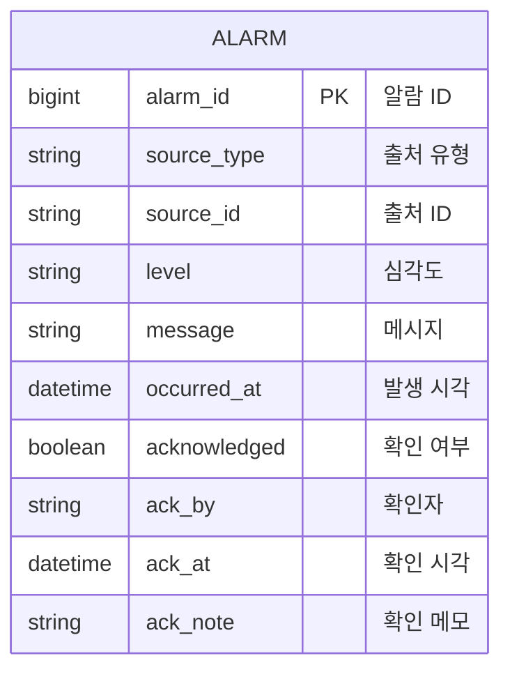

# 임시 스키마 변경 — 알람(ALARM)

> **문서 성격:** `docs/데이터 스키마 설계.md` ERD에 없던 항목을 BE 개발·API 구현을 위해 **임시로 추가**한 내용을 기록한다.  
> DB 담당 영역 merge 또는 ERD 정식 반영 시 본 문서와 BE 엔티티를 기준으로 정합한다.  
> **정식 ERD 반영 전까지** 본 파일은 설계 변경의 근거 문서로 사용한다.

## 배경

- `docs/API 정의.md` §5 알람(Alarms) API는 목록·상세·확인(ack)·생성을 요구한다.
- 기존 ERD에는 **ALARM 테이블이 없어**, 대시보드·충전 API에서 알람성 정보를 **운영 데이터(AMR 상태 로그, 충전 스테이션)** 로부터 임시 조합했다.
- 알람 API 및 확인(ack) 상태 유지를 위해 **ALARM 엔티티·테이블을 BE에서 임시 정의**한다.

## 임시 추가 테이블: ALARM

| 컬럼 | 타입 | 제약 | 설명 |
|------|------|------|------|
| alarm_id | BIGINT | PK, AUTO_INCREMENT | 알람 ID (API에서는 `alarm-001` 형식으로 노출) |
| source_type | VARCHAR(50) | NOT NULL | 출처 유형: `station`, `amr`, `env`, `external` 등 |
| source_id | VARCHAR(50) | NULL | 출처 리소스 ID (`station-1`, `amr-02` 등) |
| level | VARCHAR(20) | NOT NULL | `info`, `warning`, `critical` |
| message | VARCHAR(500) | NOT NULL | 알람 메시지 |
| occurred_at | TIMESTAMP | NOT NULL | 발생 시각 |
| acknowledged | BOOLEAN | NOT NULL, DEFAULT FALSE | 확인 여부 |
| ack_by | VARCHAR(100) | NULL | 확인 처리자 username |
| ack_at | TIMESTAMP | NULL | 확인 시각 |
| ack_note | VARCHAR(500) | NULL | 확인 메모 |

### ERD (임시)

- 타 ERD 테이블과의 FK는 **당분간 두지 않음** (출처는 `source_type` + `source_id` 문자열로 참조).
- DB merge 후 필요 시 `AMR`, `AMR_CHARGE_STATION`, `ENV_SENSOR` 등과 FK 또는 뷰로 정합 가능.

## API 매핑

| API | 비고 |
|-----|------|
| GET /alarms | `acknowledged=false` 등 필터 |
| GET /alarms/{alarmId} | `alarm-{alarm_id}` |
| POST /alarms/{alarmId}/ack | `ack_by` ← JWT 사용자, `ack_note` ← 요청 body |
| POST /alarms | 외부/시스템 알람 생성 (`source_type=external` 등) |

## BE 구현 매핑

| 구성 요소 | 경로 |
|-----------|------|
| 엔티티 | `Alarm.java` → 테이블 `ALARM` |
| Repository | `AlarmRepository.java` |
| Service | `AlarmService.java` |
| Controller | `AlarmController.java` |
| 시드 | `AlarmDemoDataLoader.java` (데모 데이터, 기존 운영 조합 로직 반영) |

## 대시보드 연동 변경

- `DashboardService`의 `activeAlarms`·`recent-alarms`는 **ALARM 테이블 조회**로 전환한다 (임시 조합 로직 제거).

## 기타 임시 스키마 관련 (참고)

| 항목 | 내용 | 문서화 |
|------|------|--------|
| USER → USERS | H2 예약어 `USER` 충돌로 테이블명 `USERS` 사용 | 본 문서 §참고 |
| 충전 스테이션 capacity | ERD에 없음, API 응답용 기본값 4 (상수) | `ChargingService` |
| Refresh token 저장 | DB 미사용, 인메모리 `RefreshTokenStore` | Auth 구현 |

## DB merge 시 체크리스트

- [ ] DB 담당 `ALARM` DDL과 본 정의 컬럼·타입 일치 여부
- [ ] `데이터 스키마 설계.md` ERD에 ALARM 반영
- [ ] MySQL 전환 시 `application-docker.yaml` datasource profile
- [ ] Node-RED 등 외부 알람 → `POST /alarms` 연동 방식

## 이력

| 일자 | 내용 |
|------|------|
| 2026-05-17 | ALARM 임시 테이블 정의 및 Alarm API 구현 착수 |
